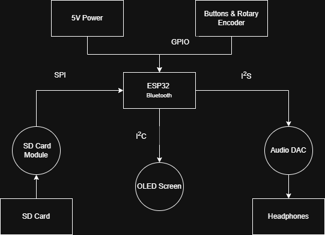

# ESP32 Audio Player

A portable audio player built around the ESP32 NodeMCU-32S using modern embedded C++.

## Features
- MP3/WAV playback from microSD
- OLED user interface
- Rotary encoder and button controls
- Wired headphone output
- Bluetooth audio support
- Built with PlatformIO

## Hardware
- ESP32 NodeMCU-32S
- SSD1306 OLED
- SPI microSD module
- I2S Audio DAC
- Rotary encoder
- Push buttons

## Project Status
🚧 Currently in development

## System Architecture

